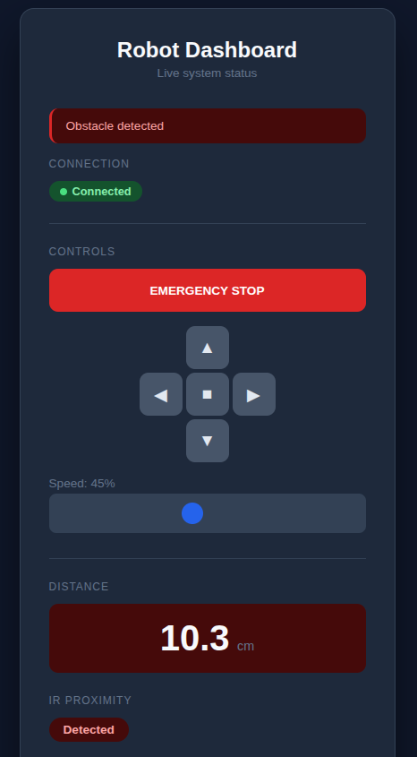
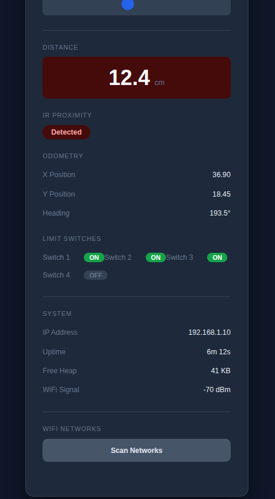

# RobotWebUI

A framework-agnostic C++ library that serves an eye-catching robot dashboard web page from an ESP8266. It provides live sensor readings, motor control, system status, and WiFi management — all over WebSocket. Designed as a drop-in template that robotics projects can integrate by instantiating a class and calling simple API methods, without touching the frontend code.

Built for ESP8266 (Arduino framework) first, with the C++ layer designed to compile under ESP-IDF later without rewriting.

## Demo





## Features

- **Live sensor readings** — real-time telemetry over WebSocket
- **Motor control** — send commands from the browser to the robot
- **System status** — uptime, free heap, WiFi signal strength
- **WiFi management** — scan networks, connect, change credentials
- **Animated dark UI** — responsive dashboard that works on mobile and desktop
- **Zero frontend build step** — all HTML/CSS/JS embedded as PROGMEM strings in C++

## Hardware

| Spec | Detail |
|------|--------|
| Board | ESP-12E (ESP8266) |
| Flash | 4 MB |
| CPU | 80 MHz |
| Free Heap | ~80 KB |

## Tech Stack

| Component | Library |
|-----------|---------|
| Build system | PlatformIO (`espressif8266@4.2.1`) |
| Async HTTP + WebSocket | [ESP32Async/ESPAsyncWebServer](https://github.com/ESP32Async/ESPAsyncWebServer) v3.10.3 |
| Async TCP (ESP8266) | [ESP32Async/ESPAsyncTCP](https://github.com/ESP32Async/ESPAsyncTCP) v2.0.0 |
| JSON | [ArduinoJson](https://github.com/bblanchon/ArduinoJson) v7.4.3 |
| Frontend | Vanilla HTML/CSS/JS (embedded, no build tools) |

## Getting Started

### Prerequisites

- [PlatformIO](https://platformio.org/) CLI or VS Code extension
- ESP-12E board

### Build and Upload

```bash
# Build for ESP-12E
pio run -e esp12e

# Upload to connected board
pio run -e esp12e -t upload

# Open serial monitor
pio device monitor -b 115200
```

### Run Unit Tests (native)

```bash
pio test -e native
```

## Project Structure

```
├── platformio.ini        # Build configuration and dependencies
├── src/
│   └── main.cpp          # Main application entry point
├── include/              # Library headers
├── lib/                  # Library source
├── test/                 # Native unit tests
├── scripts/              # Build scripts
└── docs/
    └── image/            # Screenshots and assets
```

## Design Constraints

- **Memory** — HTML/CSS/JS served from PROGMEM, never held in RAM
- **No external frontend build** — no npm, no bundler, no build step
- **Single-page app** — one HTML page at root, WebSocket for all data
- **Browser compatibility** — Chrome, Firefox, Safari on mobile and desktop
- **Framework abstraction** — C++ classes abstract Arduino-specific APIs behind interfaces for future ESP-IDF portability

## License

TBD
